# AI Revenue Recovery — System Architecture (MVP Implementation Design)

*Implements the locked product specification (v2) without modifying its decisions. 2-week MVP. Modular monolith. Technology-agnostic — no products/frameworks named.*

Every place the specification leaves a gap is marked **OPEN DESIGN DECISION** with the smallest reasonable choice, not a new feature.

---

## 1. System Context

**Actors / systems crossing the boundary:**

| Actor | Crosses boundary with |
|---|---|
| Razorpay-shaped Simulator | Emits `payment.failed`, `payment.success`, subscription-state, outreach-delivery/response, `payment_method_updated`, `customer_action_completed` events. Receives retry commands and simulated message-send commands. |
| Customer (simulated) | Never talks to the Recovery System directly in the MVP — all customer signals (response, opt-out, complaint, payment-method update, action completion) are mediated through the Simulator, since there is no live channel. |
| Ops / Human reviewer | Views the Audit Trail / Recovery Case read model; is the only actor who can act on an `ESCALATED` case (`MANUAL_OVERRIDE`). |
| Evaluation consumer | Read-only queries against Audit Trail + Recovery Case for the metrics in §14. |

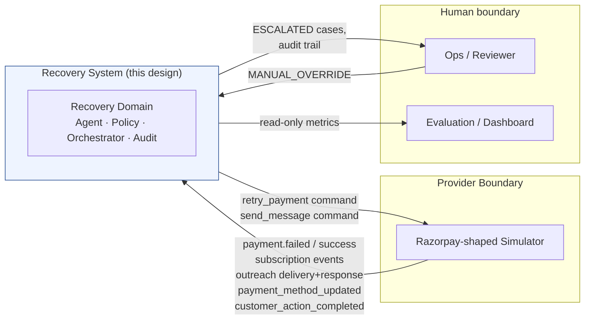

Nothing else crosses the boundary: no live Razorpay API, no real SMS/email gateway, no real card data.

---

## 2. Container / Component Design

Single deployable service (**modular monolith**). Modules communicate by in-process calls against one shared relational store — no network hops between them.

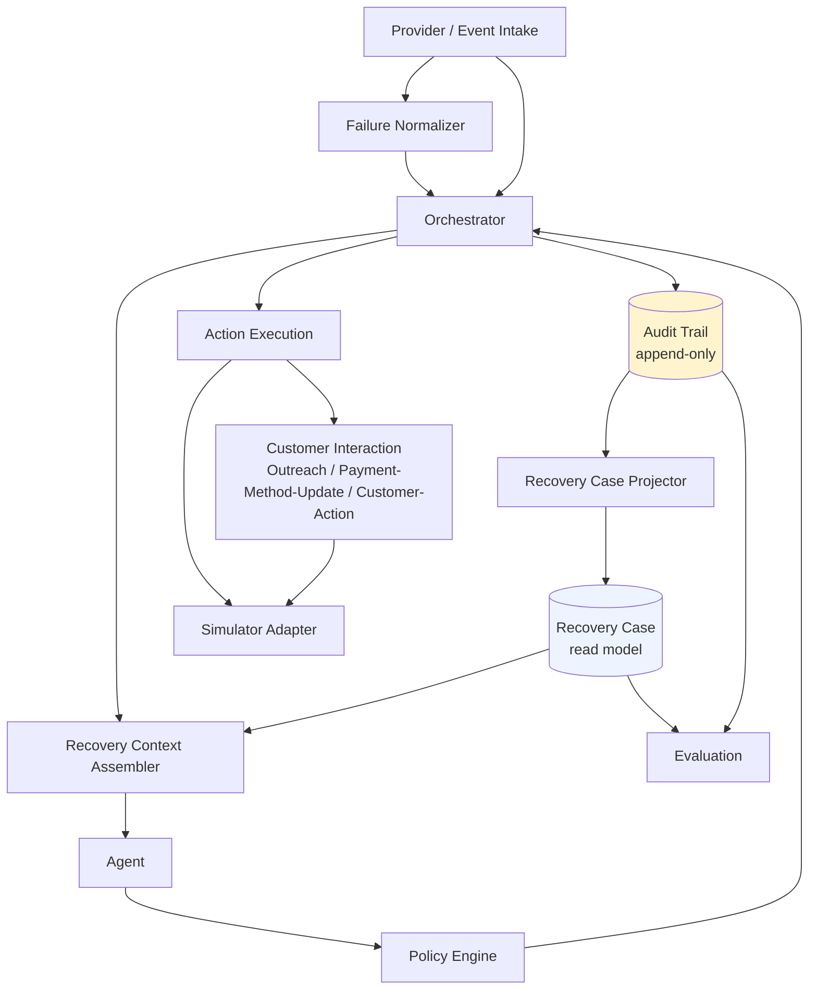

| Component | Responsibility | State owned | Inputs | Outputs | Sync/Async | Dependencies | Key invariants |
|---|---|---|---|---|---|---|---|
| **Provider / Event Intake** | Receive Simulator events, dedupe, translate to internal commands | `ingested_event_ids` (dedup only) | Simulator events | Internal commands to Orchestrator | Sync in-process call; events arrive as they're produced by the Simulator | Failure Normalizer, Orchestrator | Every event has a unique `event_id`; duplicates are acknowledged, never re-processed |
| **Failure Normalizer** | Deterministic `error_code+source+step+reason → category` mapping | None (static config table) | Raw Payment fields | `normalized_category` | Sync, pure function | None | Same input always yields same output; ambiguous input → `UNKNOWN_DECLINE` |
| **Recovery Context Assembler** | Build the full `AgentContext` fresh for one evaluation | None (read-only) | `recovery_case_id` | `AgentContext` object | Sync | Recovery Case, Audit Trail, Subscription store | Never cached across evaluations — this is what prevents stale-context bugs (§5) |
| **Agent** | Propose exactly one next operation | None — stateless per call | `AgentContext` | `{operation, timing_strategy?, reason, confidence}` | Sync call (LLM inference) | None beyond context passed in | Never writes state; output is untrusted input to Policy |
| **Policy Engine** | Validate the proposal against category allow-list + global guardrails | None (reads Recovery Case + static category-policy config) | `AgentContext` + proposal | `{allowed, reason, checks{}}` | Sync | Category Policy Table, Recovery Case (read) | Only place a proposal can be rejected; never substitutes its own operation |
| **Orchestrator** | State-machine authority: scheduling, re-evaluation triggers, Day-14 sweep, per-case serialization, execution coordination | Recovery Case *status* (sole writer), `due_actions` timer table | Event-intake commands, timer fires, sweep tick | Execution commands, Audit events | Hybrid: synchronous within one evaluation cycle; timers create asynchronous re-entry | Policy, Agent (via Context), Action Execution, Audit Trail | Sole writer of case status; every case-level write is serialized (row lock) |
| **Action Execution** | Dispatch an approved primitive to the right sub-executor | None (dispatcher) | Approved operation + params | Execution result, raises Audit events | Sync (Simulator responses are deterministic/synchronous in MVP) | Simulator Adapter, Customer Interaction | Idempotent per `action_id` |
| **Customer Interaction** *(merged: Outreach + Payment-Method-Update + Customer-Action)* | Send an approved customer-facing message; track pending flags | Outreach records | Approved send command (`kind`, channel, template) | Outreach record; later delivery/response event | Send is sync; delivery/response arrives later via Event Intake | Simulator Adapter | All three `kind`s share one budget/cooldown, per spec §12/§14 |
| **Simulator Adapter** | Provider-boundary implementation of a generic `ProviderPort` | Scenario configuration | Retry/send commands, scenario config | Simulated Razorpay-shaped events | Sync, deterministic | None (leaf) | Never talks to a real provider; output shapes match spec §17.2 exactly |
| **Audit Trail** | Append-only source of truth for the whole recovery domain | `audit_events` table | Typed audit event records | Event stream | Sync write (must commit before the operation is "done") | None (leaf, DB only) | Append-only; single writer chokepoint (`append_audit_event()`), called only by Orchestrator |
| **Recovery Case Projector** | Fold the just-appended audit event onto the Recovery Case row | *(not an independent state owner — see note below)* | The audit event just written | Updated Recovery Case row | Same transaction as the audit append | Audit Trail | Never invoked except immediately after an audit append |
| **Evaluation** | Compute MVP metrics | None (read-only, or an optional cached view) | Read query | Metrics | Sync, on-demand | Audit Trail, Recovery Case (read-only) | Cannot write anywhere — structurally cannot influence recovery decisions |

**Note on the Projector:** Design principle 11 ("no component other than the Orchestrator directly changes case status") means the Projector is not an independently-triggered peer — it is a sub-routine *inside* the Orchestrator's single write path (`append_audit_event()` always immediately calls `project()` in the same transaction). It's listed separately in the table only because the spec calls it out by name; architecturally it has no life of its own.

**Merge rationale (Payment-Method-Update + Customer-Action → Customer Interaction):** both primitives are "send an approved message, then wait for a boolean simulator flag." They differ only in which pending sub-state they set and which flag they wait for. Splitting them into separate components would be exactly the kind of premature separation the brief asks to avoid.

---

## 3. Data Ownership Matrix

| Data object | Authoritative source | Read model or source of truth | Who writes | Who reads | Mutability |
|---|---|---|---|---|---|
| Razorpay-shaped Payment | Simulator (provider) | Source of truth (mirrored) | Simulator only, via events | Event Intake, Normalizer, Context, Evaluation | Immutable once created — a retry produces a *new* Payment record, never mutates the old one |
| Subscription | Simulator (provider) | Source of truth for billing fields; Recovery System holds a mirror | Simulator drives it; Event Intake updates the local mirror on state events | Everyone | Mutable, updated via events (not append-only) |
| **Recovery Case** | Derived | **Read model — never source of truth** | Only Orchestrator, only as a direct consequence of an audit append | Agent (via Context), Policy, Evaluation, Ops | Mutable row, but write-path is a single chokepoint |
| Recovery Action | Orchestrator (creates), Action Execution (fills outcome) | Operational record, not the domain source of truth (Audit Trail is) | Orchestrator (create), Action Execution (update its own outcome fields — this does **not** touch Recovery Case status, so it doesn't violate principle 11) | Orchestrator, Audit Trail (referenced), Evaluation | One controlled lifecycle mutation: `scheduled → executed` |
| **Audit Event** | Itself | **The source of truth for the whole domain** | Orchestrator only, via one function | Everyone | Append-only, never mutated or deleted |
| Outreach | Customer Interaction (creates), Event Intake (updates on delivery/response) | Operational detail record | Customer Interaction (create), Event Intake (status/response update) | Orchestrator, Context, Evaluation | Mutable (status/response fields) — every meaningful transition is *also* mirrored into an Audit event (`OUTREACH_SENT`, `OUTREACH_RESULT`) so Audit Trail stays the complete record |
| Subscription History | Derived | Read model (computed, not stored) | Nothing writes it directly | Context Assembler | **OPEN DESIGN DECISION:** compute-on-read from Payment + Recovery Case + Audit rather than maintain a second materialized copy — smallest-surface choice for MVP scale |
| Agent decision context | Ephemeral | Not persisted as its own object | Context Assembler (creates per evaluation) | Agent only | Transient — the exact context+decision pair is captured verbatim inside the `AGENT_DECISION` audit event for reproducibility, so nothing is lost even though the live object isn't stored separately |

---

## 4. Recovery State Machine

States are implemented exactly as specified: `FAILED, EVALUATING, WAITING, RETRYING, OUTREACH_PENDING, PAYMENT_METHOD_UPDATE_PENDING, CUSTOMER_ACTION_PENDING, RECOVERED, ESCALATED, EXHAUSTED, STOPPED`.

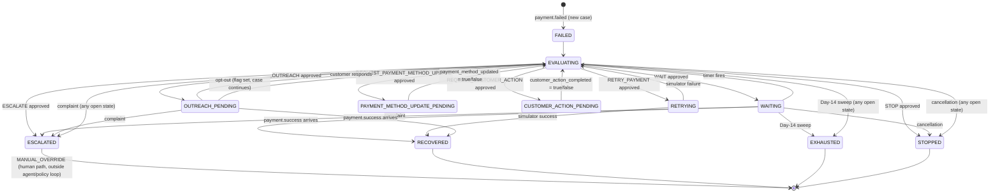

### Transition table (selected — full table mirrors the diagram)

| From | Trigger | To | Note |
|---|---|---|---|
| *(none)* | `payment.failed`, no open case for subscription | `FAILED` | New Recovery Case created |
| *(none)* | `payment.failed`, case already open | *(unchanged)* | `FAILURE_APPENDED` audit event only — **this is the duplicate/second-failure answer**: no new case, no state change, budgets/deadline are shared with the existing case (OPEN DESIGN DECISION, see §15) |
| `WAITING` | `payment.success` arrives externally | `RECOVERED` | Pending timer is cancelled |
| `OUTREACH_PENDING` | `payment.success` arrives | `RECOVERED` | Same — payment success always short-circuits to terminal, regardless of what's pending |
| `PAYMENT_METHOD_UPDATE_PENDING` | `RETRY_PAYMENT` proposed while still pending | *rejected by Policy* | "Invalid method" guardrail — retry is structurally blocked, not just discouraged |
| `PAYMENT_METHOD_UPDATE_PENDING` | `payment_method_updated=true` arrives mid-WAIT | `EVALUATING` (immediate) | External signal re-evaluates immediately rather than waiting for a stale timer |
| *(any non-terminal)* | Day-14 sweep, deadline passed | `EXHAUSTED` | Proactive; any pending scheduled action is discarded as a no-op when it later fires |
| `ESCALATED` | Human review outcome | *(no autonomous transition)* | Recorded as `MANUAL_OVERRIDE`; this is the **only** path that can set Recovery Case status after escalation |
| `RETRYING` | `retries_used` would exceed 2 | `EVALUATING`, `RETRY_PAYMENT` removed from allow-list | Retry exhaustion — Agent can still propose ESCALATE/STOP/OUTREACH per remaining budget |
| `OUTREACH_PENDING` | `outreach_used` would exceed 3 | `EVALUATING`, `OUTREACH`/`REQUEST_*` removed from allow-list | Outreach exhaustion |

**Entry/exit conditions, allowed operations per state, terminal states:** derived directly from §12/§13 of the spec — no new rules invented. Terminal for the *autonomous loop*: `RECOVERED, ESCALATED, EXHAUSTED, STOPPED`. A later `payment.failed` for the same subscription after a terminal state opens a **new** case — the single-open-case rule only restricts concurrently *open* cases.

---

## 5. Agent Boundary

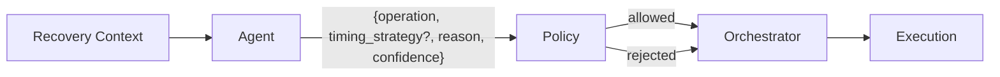

**Context assembled for the Agent** (matches spec §9/§18):

```json
{
  "current_failure": { "category": "...", "error_code": "...", "amount": 0, "failed_at": "..." },
  "recovery_history": { "retries_used": 0, "outreach_used": 0, "prior_actions": [] },
  "subscription_history": { "successful_payments": 0, "failed_payments": 0, "previous_failures": [] },
  "recovery_state": { "status": "EVALUATING", "days_since_failure": 0, "deadline": "..." },
  "customer_signals": { "opted_out": false, "complaint": false, "payment_method_updated": null, "customer_action_completed": null },
  "timing_context": { "now": "...", "next_billing_date": "...", "days_remaining": 0 },
  "allowed_primitives": ["WAIT", "RETRY_PAYMENT", "..."],
  "allowed_timing_strategies": ["WAIT_24H", "..."]
}
```

Passing `allowed_primitives`/`allowed_timing_strategies` **into** the Agent (not just checked after) lets the Agent propose validly most of the time — Policy still re-checks everything independently.

- **Agent output schema:** `{operation, timing_strategy?, reason, confidence}` — unchanged from spec §18.
- **Invalid output handling:** malformed JSON, unknown `operation`, or missing required `timing_strategy` → treated as a Policy rejection with reason `INVALID_AGENT_OUTPUT`. **OPEN DESIGN DECISION:** fall back to a deterministic safe default (`WAIT_24H` if time/budget remain, else `STOP`) rather than retrying indefinitely.
- **Timeout/failure behavior:** Agent call times out or errors → same fallback path, logged as `AGENT_UNAVAILABLE`. **OPEN DESIGN DECISION:** short timeout (illustrative: 30s) appropriate for an MVP demo.
- **Stale-context behavior:** structurally prevented, not patched after the fact — context is reassembled fresh every evaluation, and the per-case lock (§7) guarantees no second evaluation can be in flight for the same case while one is running.
- The Agent makes exactly one decision per call — no loop, no memory beyond what's in the passed context.

---

## 6. Policy Engine

**Category → allow-list**, built directly from spec §13 Table 3:

```json
{
  "SOFT_BALANCE": { "primitives": ["WAIT", "RETRY_PAYMENT", "OUTREACH"], "timing": ["NEXT_PAYDAY"] },
  "SOFT_LIMIT": { "primitives": ["WAIT", "RETRY_PAYMENT", "OUTREACH"], "timing": ["WAIT_24H"] },
  "SOFT_TRANSIENT": { "primitives": ["WAIT", "RETRY_PAYMENT", "OUTREACH"], "timing": ["WAIT_6H", "WAIT_24H", "WAIT_72H"] },
  "CUSTOMER_ACTION": { "primitives": ["OUTREACH", "REQUEST_CUSTOMER_ACTION", "WAIT", "RETRY_PAYMENT"], "timing": ["IMMEDIATE", "WAIT_72H"] },
  "PAYMENT_METHOD_INVALID": { "primitives": ["OUTREACH", "REQUEST_PAYMENT_METHOD_UPDATE", "WAIT", "RETRY_PAYMENT"], "timing": ["IMMEDIATE", "WAIT_72H"] },
  "FRAUD_RISK": { "primitives": [], "timing": [] },
  "UNKNOWN_DECLINE": { "primitives": ["OUTREACH"], "timing": ["WAIT_72H"] }
}
```

> **OPEN DESIGN DECISION (carried from the earlier architecture review):** `ESCALATE` and `STOP` are treated as **always allowed, for every category**, regardless of the table above. The specification's Table 3 only names them explicitly for 3 of 7 categories, but every category needs a terminal escape valve once its own budget is exhausted — this is the smallest fix that closes that gap without inventing new product behavior.

**Global guardrail checks — run in this order, inside one `PolicyEngine.validate()` call:**

1. Terminal-state check — case already `RECOVERED/ESCALATED/EXHAUSTED/STOPPED` → reject everything
2. Cancellation check — subscription inactive → reject everything, force `STOP`
3. Complaint check — (structurally, complaint already forced `ESCALATED` via the state machine before Policy ever runs again, so this is a second line of defense, not the primary enforcement point)
4. Category allow-list check — operation + timing_strategy on the category's list, `ESCALATE`/`STOP` always pass
5. Fraud restriction — `FRAUD_RISK` → `RETRY_PAYMENT` never allowed, independent of budget
6. Payment-method prerequisite — `PAYMENT_METHOD_INVALID` and not yet updated → `RETRY_PAYMENT` blocked
7. Customer-action prerequisite — `CUSTOMER_ACTION` and not yet completed → `RETRY_PAYMENT` blocked
8. Retry budget — `retries_used < 2` for `RETRY_PAYMENT`
9. Outreach budget — `outreach_used < 3` for `OUTREACH`/`REQUEST_*`
10. Opt-out check — blocks `OUTREACH`/`REQUEST_*` only, never `RETRY_PAYMENT`
11. Day-14 deadline check — `now < deadline`
12. Concurrency — enforced *before* Policy runs at all, via the per-case lock (§7); Policy always operates on a case it structurally has exclusive access to

Policy **only** returns `{allowed, reason}` — it never substitutes an alternative operation. That decision belongs to the Orchestrator's fallback logic (§5), keeping "what's allowed" and "what happens on rejection" as two separate concerns.

---

## 7. Orchestrator

The Orchestrator is the one component doing anything close to "workflow," and it's built from two DB-backed mechanisms plus in-process calls — no distributed workflow platform needed:

| Responsibility | Mechanism |
|---|---|
| Scheduled re-evaluation | A `due_actions(recovery_case_id, due_at, reason)` table. A single lightweight poller (runs every 1–5 minutes) selects rows where `due_at <= now()` and calls `re_evaluate(case_id)` in-process. |
| Externally triggered re-evaluation | Provider/Event Intake calls `re_evaluate(case_id)` directly and synchronously when a customer-response-shaped event arrives — no need to wait for the poller. |
| Timing strategy conversion | Pure function: `WAIT_6H/24H/72H = now + delta`; `NEXT_PAYDAY = subscription.next_billing_date`; `IMMEDIATE = now`. |
| Action scheduling | Only `WAIT` truly schedules (writes a `due_actions` row). Every other approved operation executes immediately in the same evaluation cycle. **OPEN DESIGN DECISION:** if an `OUTREACH`/`REQUEST_*` is approved outside the 09:00–19:00 communication window, the Orchestrator defers it to the next window open rather than sending immediately — this closes a gap left open in the earlier spec review. |
| Day-14 sweep | A second poller query: `recovery_cases WHERE status NOT IN (terminal) AND deadline <= now()` → force `EXHAUSTED` via the same append-audit-then-project path; any `due_actions` rows for that case are discarded as no-ops. |
| Per-case serialization | **Recommended default:** a row-level lock (`SELECT ... FOR UPDATE`) held for the duration of one evaluation cycle — simpler to reason about than optimistic versioning at MVP transaction volumes. Optimistic version-check is the noted alternative if lock contention ever becomes a real problem, which is unlikely at this scale. |
| Duplicate event handling | Unique `event_id` constraint on ingestion; duplicates acknowledged, never reprocessed. Combined with the single-open-case rule, this is the full answer to duplicate `payment.failed`. |
| State transitions | Only Orchestrator calls the internal `transition(case_id, new_status, triggering_event)` function. |
| Execution coordination | One cycle = Policy validate → (if allowed) Action Execution → capture result → append audit event → project → done. |

---

## 8. Action Execution

| Primitive | Executor | Inputs | Outputs | State transition | Audit events | Failure behavior | Idempotency |
|---|---|---|---|---|---|---|---|
| `WAIT` | Orchestrator (internal) | `timing_strategy` | `scheduled_at` on Recovery Action + `due_actions` row | → `WAITING` | `ACTION_SCHEDULED` | Can't fail (pure scheduling) | Re-scheduling the same `action_id` is a no-op |
| `RETRY_PAYMENT` | Action Execution → Simulator Adapter | `subscription_id, amount, payment_method_id` | New Payment record | → `RETRYING` → `RECOVERED`/`EVALUATING` | `ACTION_EXECUTED`, `PAYMENT_OUTCOME` | Simulator/infra error → `EXECUTION_FAILED`, **does not** increment `retries_used` (OPEN DESIGN DECISION: the case shouldn't be penalized for our own infrastructure failure); case re-queued for prompt re-evaluation | Checks Recovery Action for an existing `payment_id` before calling the Simulator again |
| `OUTREACH` / `REQUEST_PAYMENT_METHOD_UPDATE` / `REQUEST_CUSTOMER_ACTION` | Customer Interaction → Simulator Adapter | `case_id, category, channel, template_id` (template/channel chosen deterministically, never by the Agent) | Outreach record (`status=sent`) | → `OUTREACH_PENDING` / `PAYMENT_METHOD_UPDATE_PENDING` / `CUSTOMER_ACTION_PENDING` | `OUTREACH_SENT` (or `REQUEST_SENT`) | Simulated send failure → `EXECUTION_FAILED`, does **not** consume `outreach_used` (same infra-failure principle) | Keyed by `action_id`; duplicate execute is a no-op if an Outreach record already exists |
| `ESCALATE` | Orchestrator (internal) | `reason` | none external | → `ESCALATED` | `ESCALATED` | none | Re-escalating an already-`ESCALATED` case is a no-op |
| `STOP` | Orchestrator (internal) | `reason` | none external | → `STOPPED` | `STOPPED` | none | Same |

---

## 9. Simulator Boundary

Ports & Adapters: the Recovery System depends on an abstract `ProviderPort` (`retry_payment()`, `send_message()`, inbound event contract). `SimulatorAdapter` is the only implementation for the MVP.

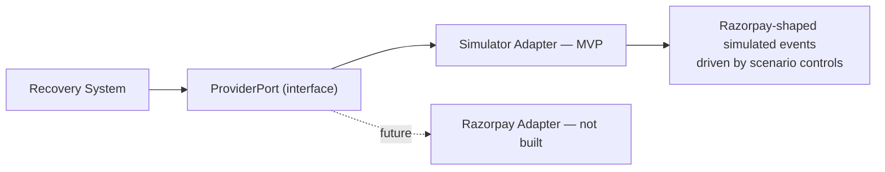

This is what makes the system "replaceable at the provider boundary" per the project constraint: swapping the Simulator for a real Razorpay adapter later touches only this one module — Orchestrator, Policy, Agent, and Audit never know the difference.

Scenario controls supported (locked, per spec §16): `failure_code, failure_behavior, customer_behavior, payment_method_behavior, customer_action_completed, would_native_retry_succeed`.

Explicitly **not** built: Razorpay's native T+1/T+2/T+3 retry loop, the full Razorpay API surface, real SMS/email delivery.

---

## 10. Audit + Recovery Case Projection

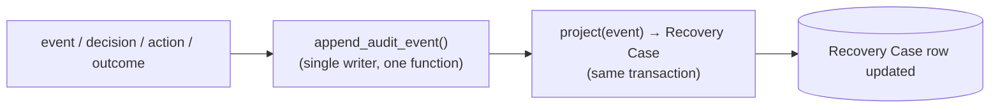

**Reconstruction:** a case can always be rebuilt from scratch via `project(SELECT * FROM audit_events WHERE recovery_case_id=? ORDER BY timestamp)` — the live Recovery Case row is just a cached result of that same pure function, never an independent fact. This is the practical payoff of "Recovery Case is a projection, not a source of truth": if the projection ever drifts, it can be regenerated with zero data loss.

**Every required question maps to a specific audit event type:**

| Question | Answered by |
|---|---|
| What failed? | `FAILURE_RECEIVED` (raw error fields) |
| Why was it categorized this way? | `FAILURE_RECEIVED` (includes `normalized_category` + the deterministic inputs) |
| What did the Agent recommend? | `AGENT_DECISION` (operation, timing_strategy, reason, confidence) |
| What did Policy allow/reject? | `POLICY_CHECK` (allowed, checks{}) |
| What action executed? | `ACTION_EXECUTED` |
| What happened? | `EXECUTION_RESULT` / `PAYMENT_OUTCOME` / `OUTREACH_SENT` |
| How much was recovered? | `PAYMENT_OUTCOME.amount` on the event that transitions the case to `RECOVERED`, cross-referenced via `Recovery Action.payment_id` |
| Why did the workflow stop? | The terminal event itself (`RECOVERED`/`ESCALATED`/`EXHAUSTED`/`STOPPED`) carries a `reason`; `MANUAL_OVERRIDE` if applicable |

---

## 11. Key Sequences

### A. Initial payment failure
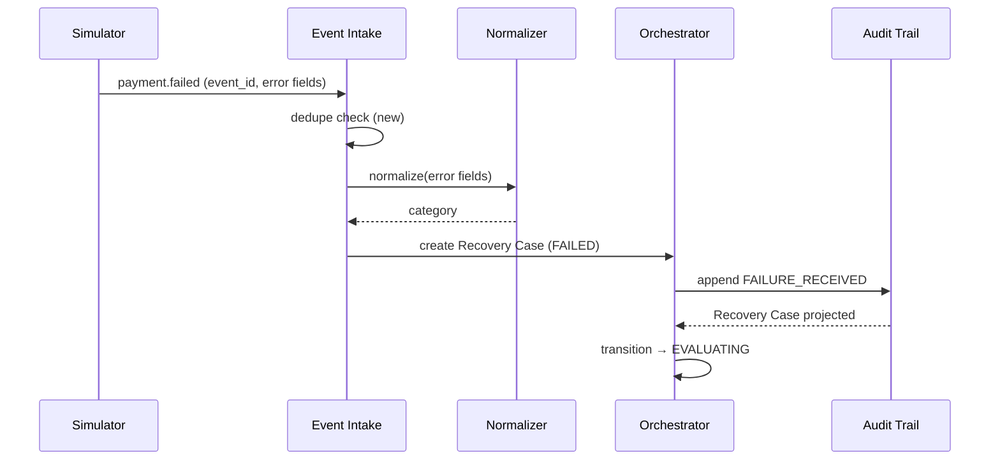

### B. SOFT_BALANCE → wait → retry → success
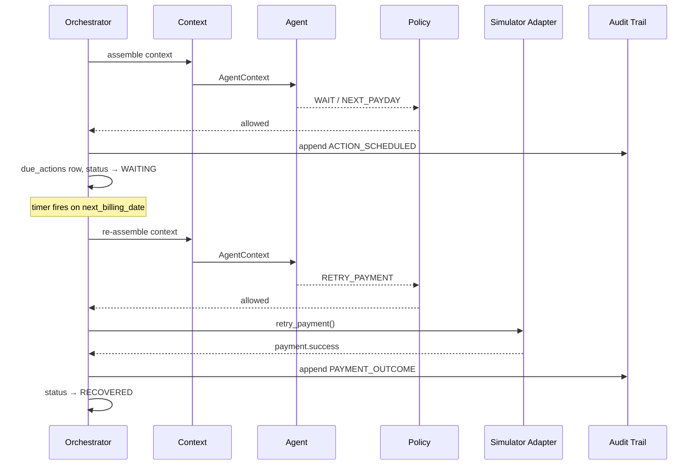

### C. PAYMENT_METHOD_INVALID → outreach → update → retry
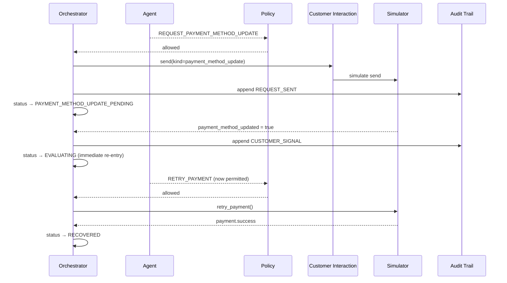

### D. CUSTOMER_ACTION → outreach → customer action → retry
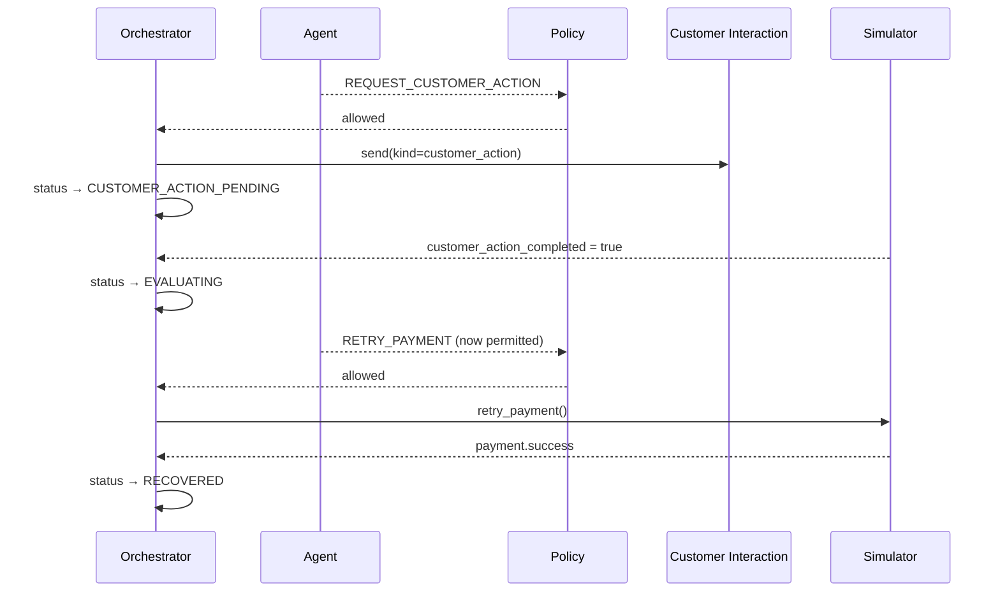

### E. Retry failure → re-evaluation → second retry
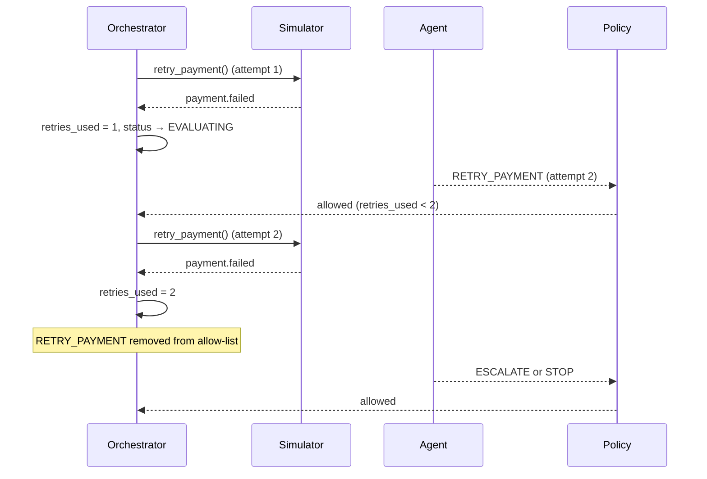

### F. Complaint → immediate escalation/stop
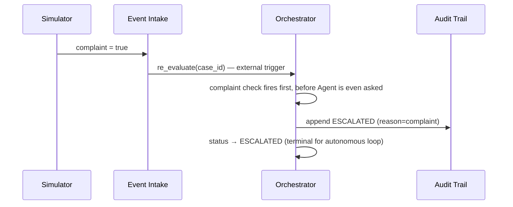

### G. Day-14 exhaustion sweep
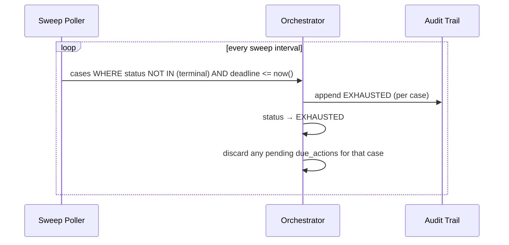

### H. Duplicate payment.failed event
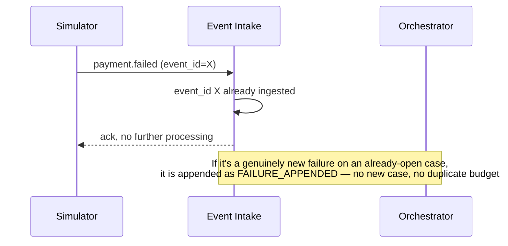

### I. Payment success arriving while an action is scheduled
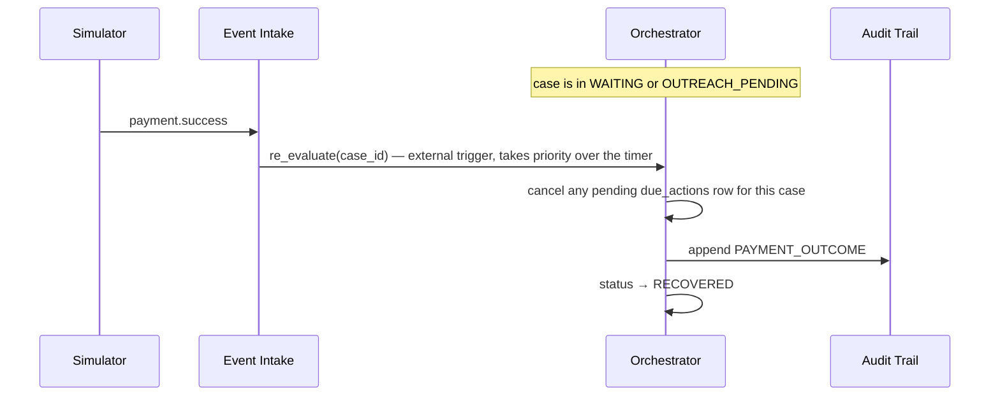

---

## 12. Failure + Concurrency Design

| Risk | Mechanism |
|---|---|
| Duplicate events | Unique `event_id` constraint at ingestion; idempotent no-op on repeat |
| Duplicate action execution | `action_id` idempotency check before every execute call |
| Stale agent decisions | Fresh context every evaluation + per-case lock make staleness structurally impossible, not just handled after the fact |
| Concurrent evaluations | Row-level lock (`SELECT ... FOR UPDATE`) held for one evaluation cycle |
| Scheduled actions firing after a terminal state | Poller checks case status before acting; a due row for an already-terminal case is a no-op |
| Simulator failures | Logged as `EXECUTION_FAILED`; does not consume retry/outreach budget; case re-queued for prompt re-evaluation |
| Audit-write failures | Audit append + Recovery Case projection are one DB transaction — if it fails, **nothing** changed, and the triggering operation is simply retried on next evaluation |

No message broker, no distributed lock manager, no workflow engine — a DB transaction and a row lock cover every case above at MVP scale.

---

## 13. Security / Privacy Boundaries

| Boundary | Detail |
|---|---|
| Agent **can** access | Normalized category, raw error fields (code/description/source/step/reason — never card data), amounts, timestamps, recovery history/outcomes, customer-response flags, timing context |
| Agent **cannot** access | Card number, CVV, OTP, any raw payment-method detail beyond an opaque `payment_method_id`, customer phone/email |
| Simulator can access | Only what Recovery System sends it: retry commands with `payment_method_id`, send commands with `case_id`/`template_id` |
| Payment credentials | Never enter the system at all — the Recovery System only ever holds an opaque `payment_method_id` reference; Audit Trail therefore never has raw card data to leak by construction |
| PII minimization | Customer contact info (phone/email) lives only inside Customer Interaction's send step, fetched at send-time; Agent/Policy/Orchestrator/Audit all operate on opaque IDs only |
| Audit integrity | Append-only at the application layer *and* recommended at the DB-permission layer (no `UPDATE`/`DELETE` grants on `audit_events` for any role) — app-logic-only enforcement is bypassable |

No enterprise IAM/security architecture is designed here — out of scope per the brief.

---

## 14. Evaluation Boundary

Evaluation is a **read-only** module (§2) — it queries Audit Trail + Recovery Case and writes nowhere. It cannot contaminate the recovery decision path because it structurally has no write path into any component the Agent/Policy/Orchestrator read from.

MVP-required (Recovery rate, Revenue recovered, Time to recovery, Escalation rate) are computed directly from terminal-state audit events plus `Recovery Action.payment_id`. The remaining metrics use the same read-only path — deprioritizing them is a build-order decision, not an architectural one.

---

## 15. Final Architecture

### A. Recommended logical architecture
A single modular monolith, one shared relational store, no network hops between internal modules. Two lightweight internal pollers (re-evaluation timers, Day-14 sweep) replace any need for an external scheduler or workflow engine. The only external-facing boundary is the `ProviderPort` interface, implemented by the Simulator Adapter for the MVP.

### B. Component diagram
See §2.

### C. Component responsibility table
See §2.

### D. Data ownership table
See §3.

### E. State machine
See §4.

### F. Critical sequences
The four most load-bearing for correctness: **B** (happy path), **F** (complaint — safety), **G** (Day-14 sweep — the proactive guardrail found missing in the earlier spec review), **I** (payment success racing a scheduled action).

### G. Architectural invariants
1. Agent proposes; it never authorizes or executes.
2. Policy is the only authority on what's allowed; it never picks an alternative.
3. Orchestrator is the only authority on workflow execution and case-status transitions.
4. Audit Trail is the append-only source of truth; Recovery Case is always a derived projection of it.
5. The Simulator is the only component that knows it's not talking to a real provider.
6. At most one open Recovery Case per subscription; a second failure appends to it.
7. Every state-changing operation is idempotent, keyed by `action_id` or `event_id`.
8. Every autonomous workflow path terminates (`RECOVERED/ESCALATED/EXHAUSTED/STOPPED`).
9. No action reaches the Simulator without passing Policy first.
10. No component other than the Orchestrator ever writes Recovery Case status.
11. The Agent never sees card credentials or raw customer contact details.
12. `ESCALATE`/`STOP` are always on every category's allow-list, regardless of Table 3's per-category listing.

### H. Deliberately NOT built in the MVP
- Microservices — one deployable modular monolith instead
- Kafka / any message broker — a DB table + poller instead
- Kubernetes / container orchestration
- A distributed workflow platform (Temporal, Airflow, Step Functions, …)
- A vector database or feature store
- Any ML pipeline beyond the single Agent call
- A real Razorpay integration — Simulator only
- Real SMS/email delivery — simulated
- Separate services per component — everything in §2 is one deployable
- Horizontal auto-scaling infrastructure
- A full enterprise IAM/security architecture
- Multi-tenant support

---

## Open Design Decisions — full list

| # | Decision | Smallest reasonable choice |
|---|---|---|
| 1 | Policy rejects the Agent's proposal | Re-invoke the Agent once with the rejection reason; if rejected again, fall back to a deterministic default (`WAIT_24H` if time/budget remain, else `STOP`) |
| 2 | `ESCALATE`/`STOP` not listed for every category in spec Table 3 | Treat both as always-allowed, every category, as a Policy-layer constant |
| 3 | Complaint terminal state | `ESCALATED` (preserves human review), not `STOPPED` |
| 4 | Invalid/timeout Agent output | Same fallback as #1 |
| 5 | Simulator/send infra failure | Does not consume retry/outreach budget; case is re-queued |
| 6 | Per-case concurrency mechanism | Row-level lock (`SELECT ... FOR UPDATE`), not optimistic versioning |
| 7 | Subscription History storage | Compute-on-read, not a separately maintained table |
| 8 | Outreach vs. 09:00–19:00 communication window | Defer send to next window open rather than sending immediately |
| 9 | Recovery Case Projector's independence | Not an independent component — a sub-routine inside the Orchestrator's single write path |
| 10 | Budget/deadline when a second failure is appended to an open case | Shared with the existing case — no separate pool, no deadline extension |

None of these expand product scope — each is the narrowest implementation choice that makes the locked specification buildable.
